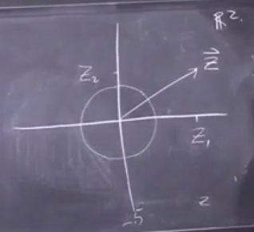

- [Asymptotic](#asymptotic)
- [Central Limit Theorem](#central-limit-theorem)
  - [Idea](#idea)
  - [Intuition](#intuition)
  - [Setup](#setup)
  - [Required Understanding of Variance](#required-understanding-of-variance)
    - [Constants in Variance](#constants-in-variance)
  - [Strategy - Use Standardization of Mean and Variance](#strategy---use-standardization-of-mean-and-variance)
    - [Get Mean 0](#get-mean-0)
    - [Get var 1](#get-var-1)
  - [An Example](#an-example)
    - [Standardize](#standardize)
  - [Central Limit Theorem Stated](#central-limit-theorem-stated)
- [Corollary](#corollary)
- [Fundamental Theorem of Algebra](#fundamental-theorem-of-algebra)
- [Gaussian Random Variable](#gaussian-random-variable)
- [Population](#population)
- [Probability Distributions](#probability-distributions)
  - [Discrete Probability Distribution](#discrete-probability-distribution)
  - [Continuous Probability Distribution](#continuous-probability-distribution)
  - [Joint Probability Distribution](#joint-probability-distribution)
    - [Joint Probability Mass Function](#joint-probability-mass-function)
- [Sample](#sample)
- [Variance](#variance)
  - [Population vs Sample Variance](#population-vs-sample-variance)

# Asymptotic

A line whose distance to a given curve tends to zero. An asymptote may or may not intersect its associated curve.

# Central Limit Theorem

[Central Limit Theorem Lecture](https://www.youtube.com/watch?v=r9S2fMQiP2E&list=PLm3J0oaFux3ZYpFLwwrlv_EHH9wtH6pnX&index=11)

## Idea
You have some algorithm which succeeds with probability P and you run it a bunch of times independently and you want to
 understand something about the total number of times it succeeds.

## Intuition

Let's say we have a really strange dice that follows the above discrete probability distribution. We are going to take samples of it, then average the samples, and look at the frequency of the averages (mean) we get.

Say we have sample size of $n=4$. Then $S_1=[1,1,3,6]$ which gives you $\bar{x_1}=2.75$. Note: This would be the first sample. It is a sample of samples!

$S_2=[3,4,3,1] \rightarrow \bar{x_2}=2.75$

$S_3=[1,1,6,6] \rightarrow \bar{x_3}=3.5$

$\vdots$

$S_{10,000}$

Now we need to plot the frequency of the sample means.

Each dot represents a sample mean which had 4 data points. Notice as we take increasingly more, it looks increasingly like a normal distribution. If you were to take a larger sample size, the graph would be taller around the original mean.

## Setup
Let $X_1, X_2, ... , X_N$ be iid random variables independently/identically distributed. Identically
distributed means that they come from the same probability distribution. The variables have $Pr[X_i=1]=p$ and
$Pr[x_i=0]=1-p=q$ probability. You could say each $X_i$ is a bernoulli random variable with probability of success $p$.
Let $S_n=X_1+X_2+...+X_n$.

## Required Understanding of [Variance](#variance)

We want to understand the expectation/mean. $E[S_n]=np=E[X_1]+...+E[X_n]$. We know this from the rule *linearity of
expectation* which says the expectation of a sum is equal to the sum of the expectations. Each of the random variables
has expectation $p$ beacuse the probability of $X_i=1$ we defined as $p$.

In our problem $Var[S_n]=npq=np(1-p)$. We explain why below.

Remember the variance is  
$Var[Y]=E[(Y-\mu)^2]$ where $\mu=E[Y]$  
=$E[Y^2]-E[Y]^2$  
$Var[Y+Y']=Var[Y]+Var[Y']$ where $Y,Y'$ are iid.

This means the sum $S_n$ is the sum of the independent variances ($X_i$). We can use the rule $E[Y^2]-E[Y]^2$ to calculate the variance of an $X_i$. In our case $X_i$ has the property that $X_i^2$ is only either 1 or zero so $E[Y^2]$ is just 1 with probability $p$ and we know its expectation is only $p$ so we get $p-p^2$. Factor out the $p$ and you get $p(1-p)$ which we know is the same as $pq$.

 $Var[X_i]=p-p^2=p(1-p)=pq$.

 You can now use the equation $Var[Y+Y']=Var[Y]+Var[Y']$. Since each $X_i$ has variance $pq$ then the variance of $S_n$ is simply $npq$.

### Constants in Variance

$Var[Y+c]=Var[Y]$. A constant is just a value that is independent of everything else and subsequently does not affect
the value of the variance.

$Var[cY] = c^2Var[Y]$  
$\sigma=stddev[Y]=\sqrt(Var[Y])$

We frequently work with standard deviation because the units are more intuitive. You could use the variance but consider
that variance is $\sigma^2$ which means our units would be squared. We square everything to make sure it is positive.
However remember that when we do $\sqrt \sigma^2$ now there are two possible answers - one negative one positive.
See [Fundamental Theorem of Algebra](#Fundamental-Theorem-of-Algebra)

## Strategy - Use Standardization of Mean and Variance

If you have some random variable it is helpful to start by finding it's mean and variance first. If you can do both of
these things you should standardize your random variable which means make it have mean 0 and variance 1. You can
arrange for that by performing some operations which we call standardizing the variable.

### Get Mean 0

$S_n-np$ Remember $np=E[S_n]$ which is the same as the mean. That is to say, to get $S_n=0$ you subtract the mean from
it. This operation is sometimes called [*centering*](https://www.theanalysisfactor.com/center-on-the-mean/). You subtract a constant (here the mean) from every value of the variable in the set. You can see the effect with the dice:

This *does not* affect the variance which you can see from the rule $Var[Y+c]=Var[Y]$.

### Get var 1

Multiply $1/stddev$. Remember the stddev is the square root of the variance. So you get
$np=\dfrac{S_n-np}{\sqrt(npq)}$ where $\sqrt(npq)=\sigma$. That makes a random variable with mean 0 and variance 1 and therefore standard
 deviation 1.

In general if you have any random variable you could define the standardized version as
$Z=\dfrac{S-\mu}{\sigma}$ where $\mu$ is the mean and $\sigma$ is the standard deviation of $S$.

**TODO** what does S mean here.

$Pr[S\le u]=Pr[\mu+\sigma Z\le u]=Pr[Z\le\dfrac{u-\mu}{\sigma}]$

If you understand the distribution of $S$ then you also understand the distribution of $Z$ and vice versa.

## An Example

Flipping coins.

$p=\dfrac{1}{2} , q=\dfrac{1}{2} , S_n=X_1+...+...X_n$

$\mu=E[S_n]=\dfrac{n}{2} , Var[S_n]=\dfrac{n}{4}  \sigma=\dfrac{\sqrt(n)}{2}$

This makes intuitive sense. If you flip a coin, the expectation should be 1/2 but it may vary a bit by $\sqrt(n)$

### Standardize

$Z_n=\dfrac{S_n-\dfrac{n}{2}}{\dfrac{\sqrt(n)}{2}}$

Multiply top and bottom by 2 and factor out $1/\sqrt(n)$

=$\dfrac{1}{\sqrt(n)}(2S_n-n)=\dfrac{1}{\sqrt(n)}(2X_1-1+2X_2-1+...+2X_n-1)$

Notice, because the probability of $X_n$ being 1 is 1/2, in the equation $\dfrac{1}{\sqrt(n)}(2X_1-1+2X_2-1+...+2X_n-1)$
the terms $2X_1-1+2X_2-1$ are each half the time -1 or +1 because the value of $X$ is either 0 or 1. These are called *Radamacher Random Variables*.

Assuming $n$ is even: $Pr[S_n=\dfrac{n}{2}]=Pr[Z_n=0] \asymp \sqrt(\dfrac{2}{\pi})*\dfrac{1}{\sqrt(n)}$
where $\asymp$ means asymptotic to and Sterling's Formula is how $\sqrt(\dfrac{2}{\pi})*\dfrac{1}{\sqrt(n)}$ was derived. **TODO: What is that*?* It is Pr[Z_n=0] because remember while the mean of $S_n$ is $n/2$ the mean of $Z_n$ has been standardized such that its mean is 0.

Histogram of $Z_n$'s probabilities as $n$ becomes increasingly large:

$\dfrac{2}{\sqrt(n)}$ is the width of a single bar. **TODO** Why are the maximum possible values of $Z_n$ $\sqrt(n)$ and $-\sqrt(n)$? See [video](https://youtu.be/r9S2fMQiP2E?t=1141)

## Central Limit Theorem Stated

C.L.T Let $X_1, X_2, ...$ be i.i.d random variables that have a mean and a non-zero variance then the associated random variable $\lim_{n \to \infin} Z_n \rightarrow Z$ where $Z_n$ is standardized with mean 0 and variance 1 and $Z$ is a standard gaussian random variable. $\forall u \in \reals Pr[Z_n \le u]=Pr[Z \le u]\plusmn o(1)$ The little $o(1)$ is with respect to $\lim_{n \to \infin}$.

This theorem by itself is not useful in computer science because it does not give any information about the rate of the error. Furthermore this rate  could actually depend on $u$ which is problamatic. To add bounds see the Berry-Esseen Theorem.

# Corollary

A proposition inferred immediately from a provide proposition with little or no additional proof. Something that naturally follows.

# Fundamental Theorem of Algebra

Every polynomial eg. $x^n+ax^n-1+a_n=0$ has $n$ roots if $x \in \mathbb{C}$. The quadratic formula answers $ax^2+bx+c=0$ for $x$. The power, two here, is the number of roots."

# Gaussian Random Variable

**Definition** $Z\sim N(0,1)$ The $\sim$ means that this random variable has the following distribution. The $N$ means normal and is effectively a synonym for gaussian. $Z\sim N(0,1)$ is the same as saying "$Z$ is a standard guassian/normal r.v (random variable)". Standard means it has been standardized - that is it has mean 0 and variance 1. That is what the 0 and 1 refer to in $N(0,1)$.

$Z$ is a continuous r.v with [pdf](#continuous-probability-distribution):

$\phi(Z)$ represents the probability that the random variable $Z$ will be in the range between $Z$ and $Z+\epsilon$ divided by $\epsilon$. The formula is 

$\phi(Z)=e^{Z^2}$ this is the important part. The full equation is $\phi(Z)=\dfrac{1}{\sqrt(2\pi)} e^{Z^2/2}$

$e^{-Z^2}$ is the most important part. We have already seen the plot of it:

The reason that $e^{-z^2}$ is the important part is that when you add multiple gaussians that gives you the sum of squares which in a vector is its length squared. That's the important features of gaussians. The /2 is not mandatory - it just makes it so the variance of 1 otherwise you get variance $1/\sqrt(2)$ . Finally, this has to be a PDF meaning that the integral sums to 1. That's why we have the $\dfrac{1}{\sqrt(2\pi)}$

Fact: $\int_{-\infty}^{\infty}e^{-z^2/2}dz=\sqrt(2\pi)$

That's why you have to divide by $\sqrt(2\pi)$ to get the variance of 1.

Fact: Let $\vec{z}=(z_1,...,z_d) \in \reals^d$, where $z_1,...,z_d$ is iid $N(0,1)$. This means pick $d$ many Gaussians independently and then stack them into a vector or a point in $d$ dimensions. Having done that, then $\vec{z}$'s distribution is rotationally symmetric.

For example take $d$ as 2. Pick two of these Gaussian variables. The angle is uniformly random - it is equally likely to point in any direction.

The intersection with the circle is equally likely to be anywhere on that circle. We do not know how long the vector is. It is even true true when $d$ is 1 which just says Gaussians are equally likely to be positive or negative.

pdf of $\vec{z}$ at $\vec{z}=(z_1,...,z_d)$ because the components are independent it means that you just multiply the PDFs which means:

$\phi(z_1) \phi(z_2) \phi(z_3) ...\phi(z_d)=\dfrac{1}{\sqrt(2\pi)}e^{-((z_1)^2+...+(z_d)^2)/2}$

Notice the exponents add so you get $(z_1)^2, (z_2)^2, (z_3)^2, etc.$ What is important is to notice that $(z_1)^2+...+(z_d)^2$ is the same as $\lVert \vec{z}^2 \rVert$. You can see that the PDF of this random variable, the amount of probability that it puts near the point little z, only depends on $z$, the vector.

# Population

The population is the population under study in statistics. Ex: The height of a man. This implies all men who exist or have ever existed.

# Probability Distributions

The mathematical function that gives the probabilities of occurrence of different possible outcomes for an experiment. It is a mathematical description of a random phenomenon in terms of its sample space and the probabilities of events (subset of the sample space).

On the left side of the PDF is **not** the probability! It is an abstract function that when integrated is the probabiltiy of $X \in a,b$.

## Discrete Probability Distribution

Por lo general significa por una $x$, la probabilidad que tiene un valor especifico es:

1. $P[X=x]=p(x)=px$
2. $p(x)$ no es negativo
3. La suma sobre todos los $p(x)$ es 1 

$\sum_{j}^{}=1$ donde $j$ representa todos los valores que puede tener $x$ y $p_j$ es la probabilidad en $x_j$. For example say you have a barrel with 100 balls each with a number. $x={1...100}$. $P(x)$ for each is $\dfrac{1}{100}$. You can make a probability mass function (PMF) like so:

## Continuous Probability Distribution

A non-negative function on the reals whose integral is 1.

Say you instad want to know the probability someone is exactly 1.73m tall. No one is exactly that height so we have to use a probability density function:

Where $\int_{-\infty}^{\infin} PDF dx=1$

## Joint Probability Distribution

A joint probability is the probability of two events happenig together:

$\dfrac{P(A and B)}{P(A\cap B)}$

A joint probability distribution shows a probabilty distribution for two or more random variables:

$f(x,y)=P(X=x, Y=y$

The point of this is to understand the relationship between two variables.

Ex: this table could represent some joint distribution:

|   |   |                | x              |                |
|---|---|----------------|----------------|----------------|
|   |   | 1              | 2              | 3              |
|   | 1 | 0              | $\dfrac{1}{6}$ | $\dfrac{1}{6}$ |
| y | 2 | $\dfrac{1}{6}$ | 0              | $\dfrac{1}{6}$ |
|   | 3 | $\dfrac{1}{6}$ | $\dfrac{1}{6}$ | 0              |

The probability $(2,3)=\dfrac{1}{6} (y,x)$

### Joint Probability Mass Function

If variables are discrete (like above) the distribition can be described by a joint probability mass function (PMF). Said another way: if you have found all probabilities for all possible combiantions of $x$ and $y$, then you have created a joint PMF.

If you have continuous variables you can describe them with a probability density function (PDF).

You can't write out all the possibilities because they are infinite BUT you can create a formula. The formula that describes all possible combinations of $x$ and $y$ is called a *joint PDF*.

# Sample

In contrast to the [population](#population), the sample comes from the population. Maybe you survey randomly a bunch of men about their height.

# Variance

$var(x)=E[(X-\mu)^2]=\sigma$

The variance is the expected value of the squared variation of a random variable from its mean value. It estimates how far a set of random numbers are spread out from the mean value. Variance is represented using one of the following three notations: $\sigma^2, s^2, Var(x)$. The higher the variance the more the data is spread out from the mean. The formula in words is the variance is the expectation of the squared deviation of a random set of data from its mean value. It is worth noting the expected value is the same as $\mu$. $\hat{x}=\mu=E[x]$

## Population vs Sample Variance

Real-world observations such as yesterday's rain cannot typically be complete sets of observations. Subsequently we calculate variance based on samples which are incomplete. To make this calculation we use an *estimator* equation based on the sample data which must be drawn without observational bias from the whole population. The simplest estimators for population mean and variance are the mean and the variance of the sample. They are *consistent estimators* which means they converge to the correct values as the number of samples increases. Sample variance is computed by the average of the squared deviation from the sample mean, diveded by $N$. See [Population variance and sample variance](https://en.wikipedia.org/wiki/Variance#Population_variance_and_sample_variance)

Also see my notes on [Required Understanding of Variance](#required-understanding-of-variance)