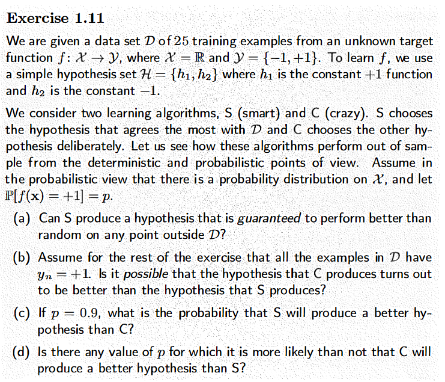
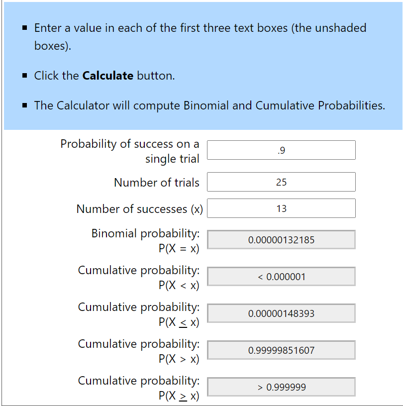

# Exercise 11

## (a)

Can $S$ produce a hypothesis that is guaranteed to perform better than random on any point outside $D$? 

No, there is no way to absolutely guarentee $S$ is better outside $\mathcal{D}$. The worst case scenario that $\mathcal{D}$ just happens to be either all -1 and everything outside $\mathcal{D}$ is 1 or vice versa, while unlikely, is impossible to eliminate.

## (b)

Assume for the rest of the exercise that all the examples in $\mathcal{D}$ have $y_n=+1$. Is it *possible* that the hypothesis that C produces turns out to be better than the hypothesis that S produces?

Yes, see reasoning from *(a)*.

## (c)

If $\mathcal(p)=.9$ what is the probability that $S$ will produce a better hypothesis than $C$?

The probability that $S$ will produce a better hypothesis is extremely high:

There still exists the possibility that in our 25 sample trial, it just so happens that at least 13 of those samples could be -1 which would then lead to S selecting -1. In which case C would actually be better.

## (d)

For any $p$ less than .5 $C$ would be better.