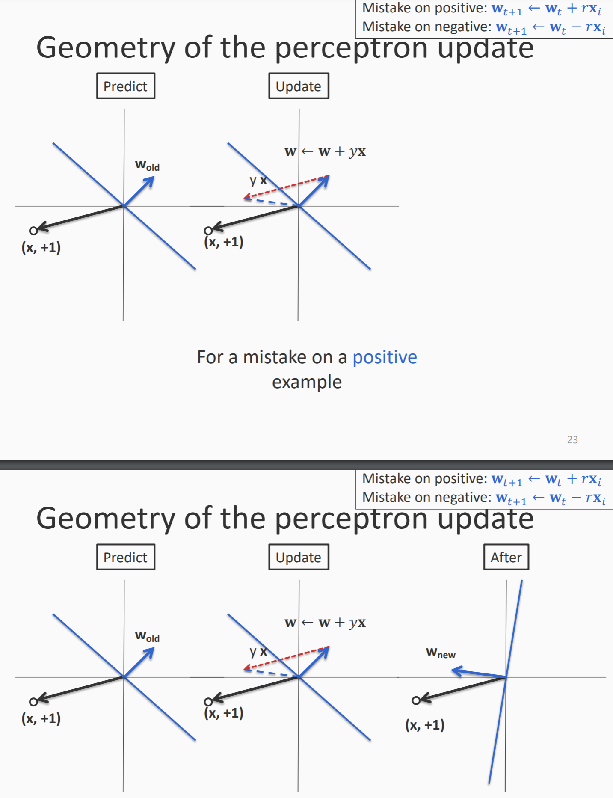
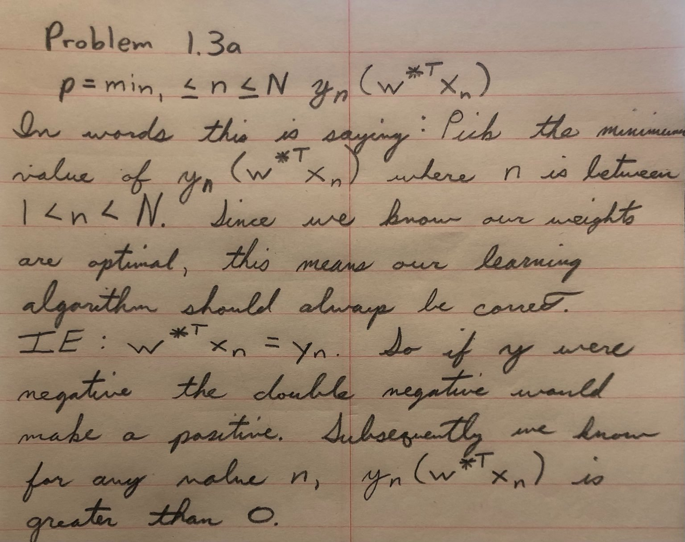
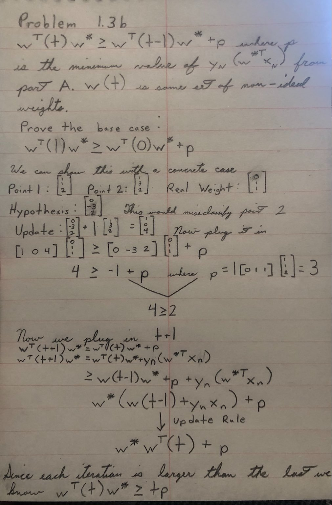
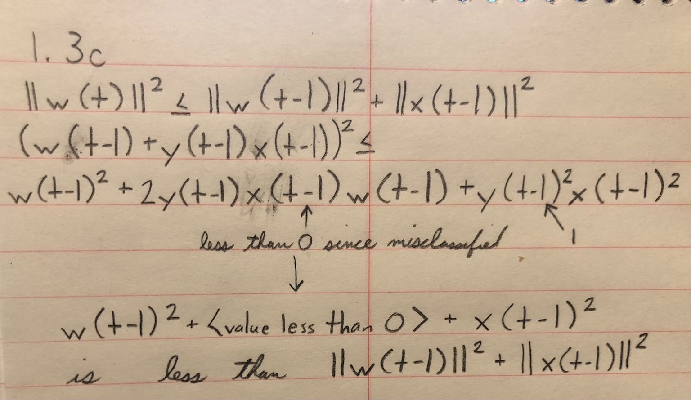
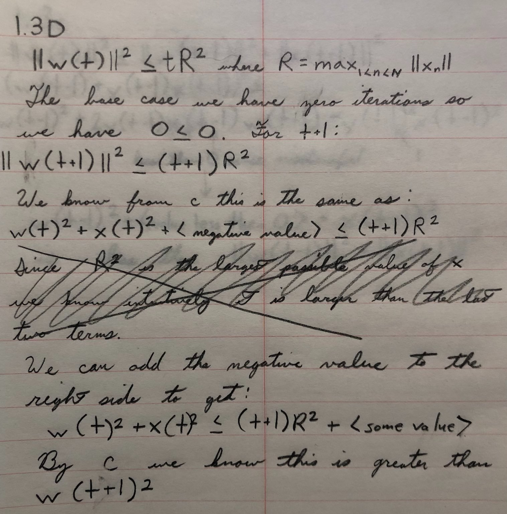
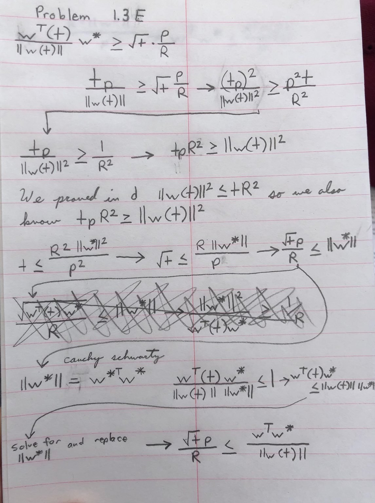
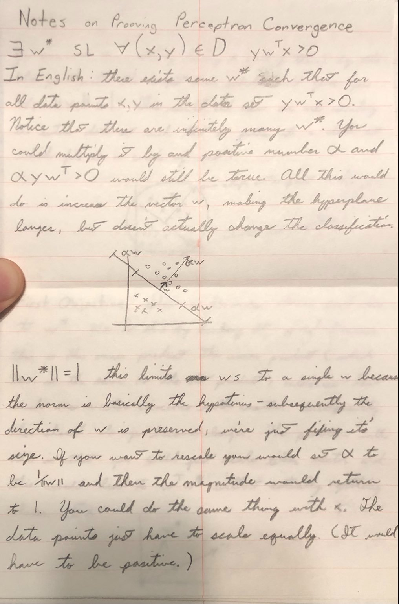
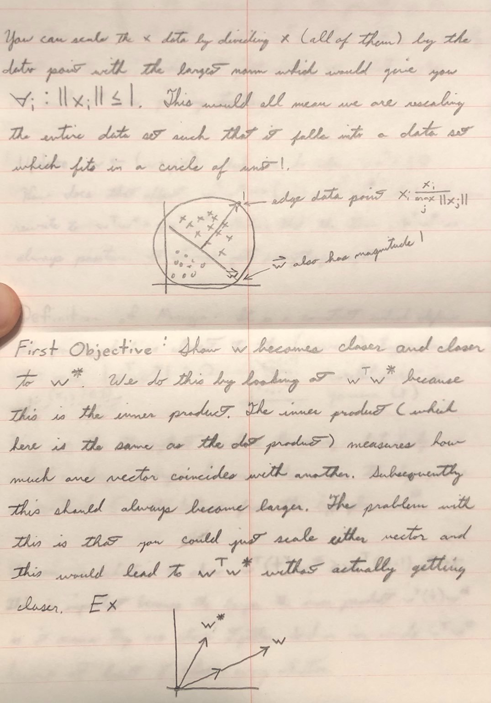
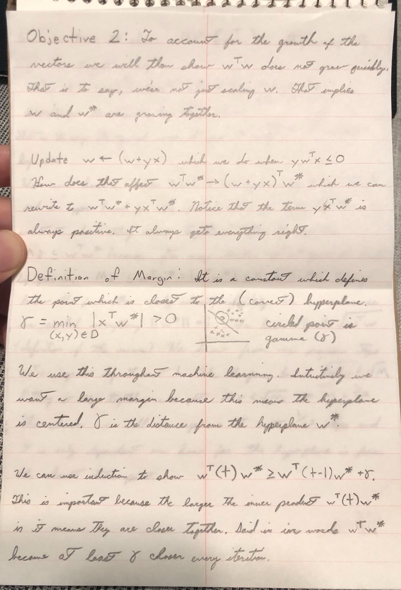
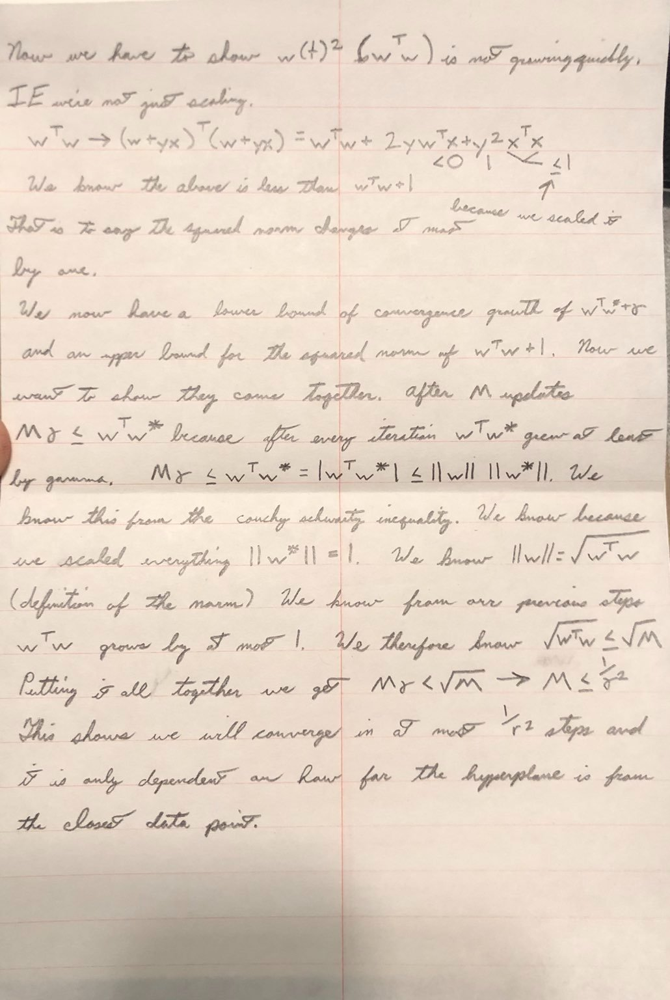

# Problem 1.3

[Useful Explanation](https://leimao.github.io/blog/Perceptron-Convergence-Theorem/)

A useful explanation of the "whys" of some of the proof by Tommi Jaakkola is [here](https://leimao.github.io/downloads/blog/2017-05-15-Perceptron-Convergence-Theorem/perceptron_convergence_theorem.pdf)

To understand the idea behind the proof, it is important to understand the geometry of Perceptron itself as it is the geometry from which we derive the proof.

[This slideshow](https://svivek.com/teaching/lectures/slides/perceptron/perceptron.pdf) has a really good graphical depiction of the Perceptron in action starting on page 18. 

[This lecture](https://www.youtube.com/watch?v=kObhWlqIeD8&t=2475s) goes through the entire proof
## Part A

This is saying that a mistake (our algorithm got y wrong) is the same as $y_t(w)^{T}x_t<0$. Subsequently, if that is the definition of a mistake, then the definition of absolute success is that for the lowest possible value of $y_n(w^{*T}x_n$ (the point closest to the hyperplane), then it would still be positive (not a mistake). This then implies that if we have the correct weights, all our points are correctly separated.
## Part B

We have two goals with this proof:

1. Show that $w^{*}w$ is growing quickly. That is to say, the correlation between the correct hypeplane and our hyperplane is growing quickly.
2. That $w^{T}w$ is not growing quickly. This is the same as just scaling our $w$ vector which is useless and doesn't imply that we are converging with $w^{*}$.

Subsequently, here we show that with each iteration of the algorithm we are at least $p$ closer to converging $w^{T}w^{*}$. (See my notes from the lecture for a proof not requiring induction)

## Part C

## Part D

Note: R is effectively a scale factor. If we divide everything by R you scale all the data into a unit circle size 1.

## Part E

## My Proof Notes

