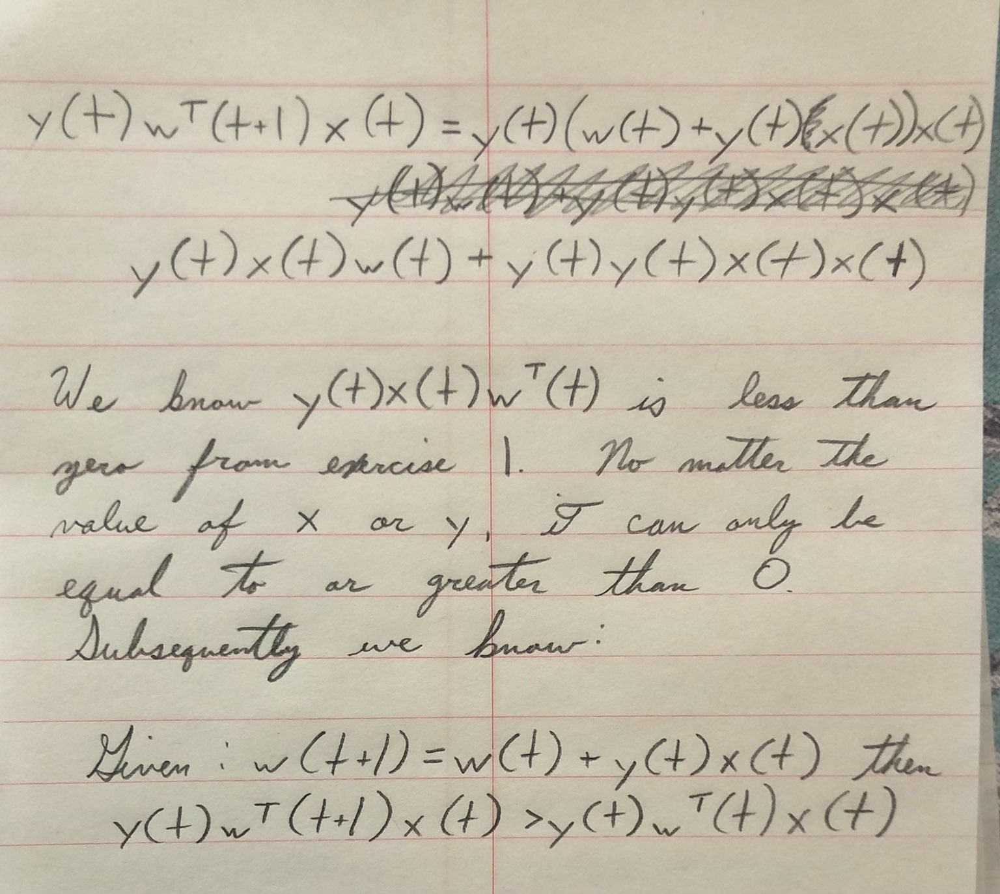

# Exercise 1.3

Note to self: Remember, $w^T$ is a transpose because $x(t)$ is a row. In order to multiply $w^T$ by $x(t)$ one of them must be a vector instead of a row. $y(t)$ is a scalar 

## Problem a

# Problem b

Edit: When I said "it" here I meant the equation in the proof.

# Problem c

We know $y=b+w^Tx$

From problem b we know that $w^T(t)x(t)$ is growing with each iteration. Some positive value $y(t)y(t)x(t)x(t)$ is added after each iteration. $y$ is just a sign. In the case that y is positive but $w^T(t)x(t)$ is negative, it is becoming less negative with each iteration. If y is negative and is positive $w^T(t)x(t)$, the fact that it is greater than $y(t)w^T(t)x(t)$ implies that with each iteration $w^T(t)x(t)$ is becoming smaller with each iteration and trending toward negative.