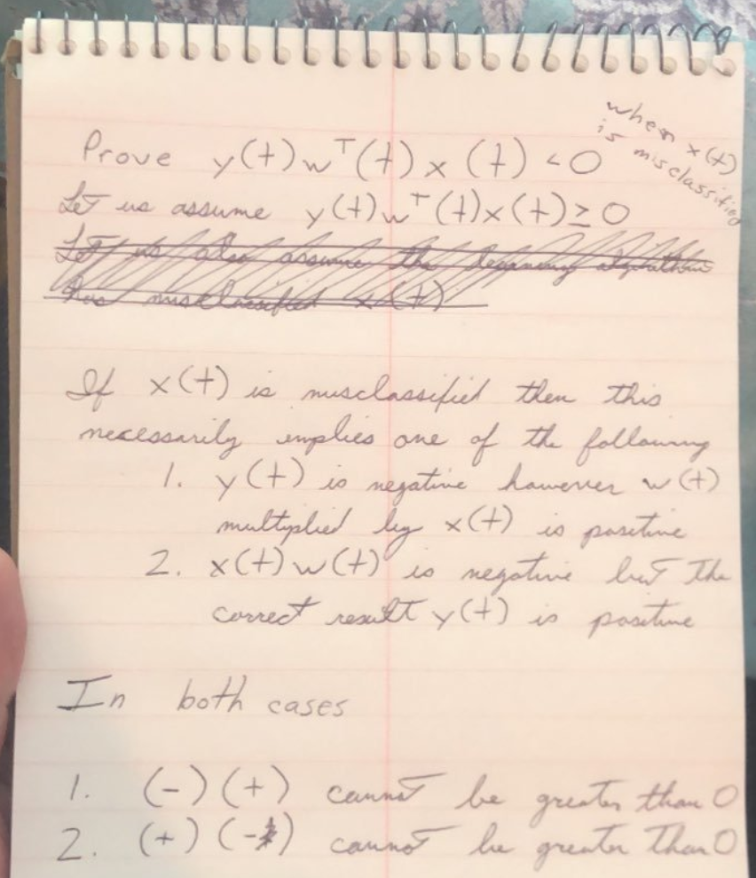

# Exercise 1.3

Note to self: Remember, $w^T$ is a transpose because $x(t)$ is a row. In order to multiply $w^T$ by $x(t)$ one of them must be a vector instead of a row. $y(t)$ is a scalar 

## Problem a

# Problem b

