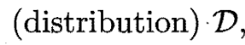
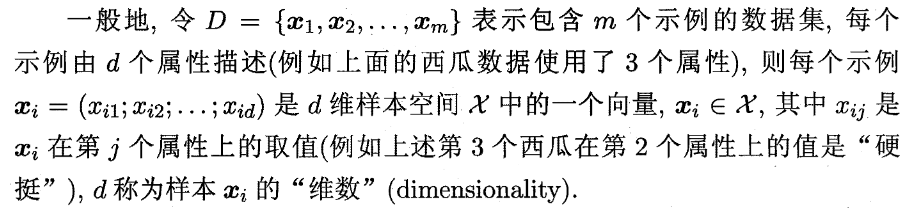
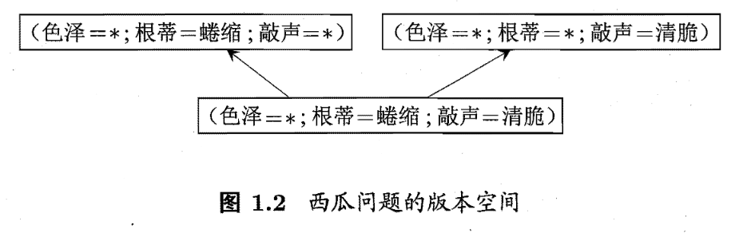
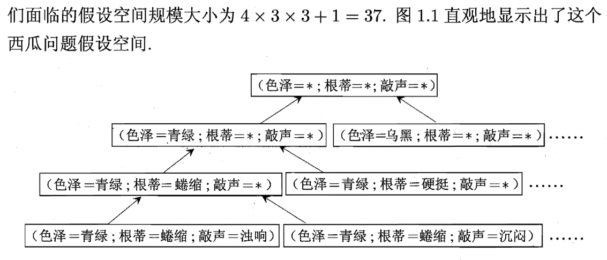
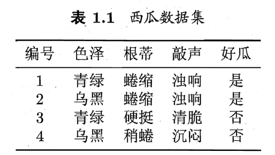
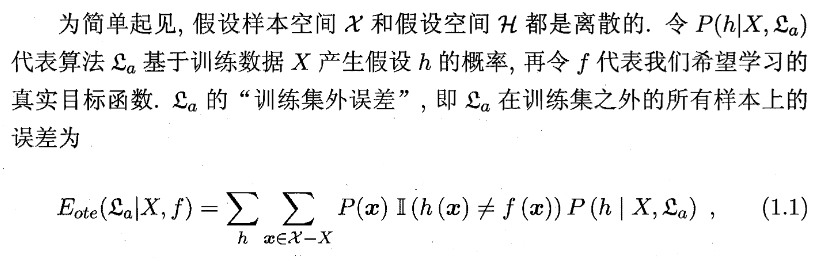
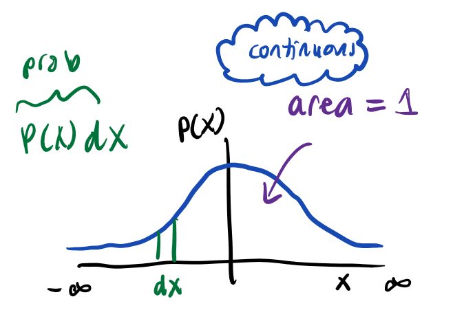
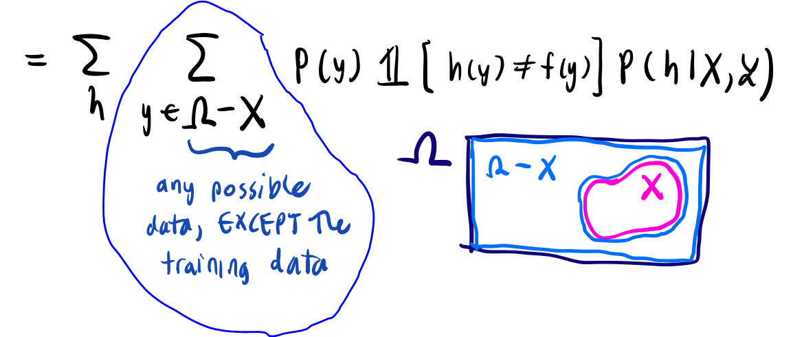

# 机器学习

## 关键单词

- 模型 (model)
- 学习算法 (learning algorithm)
- 数据集 (data set). 例如：

      (色泽=青绿;根蒂=蜷缩;敲声=浊响)，(色泽=乌黑;根蒂:稍蜷;敲声=沉闷)，(色泽=浅自;根蒂t硬挺;敲声=清脆)

- 示例 (instance) - 这是一个具体东西，比如一个西瓜。反映时间或对象在某方面的表现或性质的事项，例如：色泽。例如：`(色泽=乌黑;根蒂:稍蜷;敲声=沉闷)`
  - 样本 (sample) - 跟示例一样
    - 样本空间 （sample space)
- 特征向量 - 跟示例和样本一样
- 副主 (attribute): 例如：根蒂
  - 属性值 (attirbute value) 例如：青绿
  - 属性空间 (attribute space)
  - 特征 (feature) 跟属性一样
    - 特征向量 (feature vector) - 如果把一个特征放在三维坐标轴，这个位置较特征向量
    - 特征选择 （feature selection)
- 维数 (dimensionality) - 这是一个示例的属性的数量。比如一个西瓜可以有色彩，根底本质，敲起来声音， 等。有四个属性，那维数是三。一般地，d表代维数
- 训练数据 （training data)
- 训练样本 (training sample)
- 训练集 (training set)
- 学习器 （learner）- 模型亦称学习器。
- 预测 （prediction)
- 標記 (label) - 通常有结果。本书用好瓜
- 标记空间 （label space)
- 样例 (example) - 拥有示例和它的标记叫样例
- 样本 （sample) - 有时候整个数据集亦称样本。这个单词可以表示一个示例（一个西瓜）或者可以是一个西瓜多。要看上下文
- 分类 (classification) - 若我们预测结果这叫分类。比如好瓜或坏瓜
- 回归 (regression) 如果我们想知道连续值，例如西瓜成熟度.95
- 二分类 (binary classification) 若只有两个类别，这是二分类。
- 正类 (positive class) - 在二分类里，这是“好”的类别。反类 (negative class) 是相反
- 多分类 (multiclass classification) - 有二类别多
- 测试样本 - 被预测的样本
- 聚类 (clustering)
  - 笔记：我们常常没有标记；是噢们想知道类型 - 比如说是个浅色瓜
- 簇 cù (cluster)
- 监督学习 (supervised learning) 我们已经有标记。 包括分类学习，回归学习，等。。。
- 无监督学习 (unsupervised learning) 我们没有标记。 包括聚类学习
- 泛化 (generalization)　学的模型适用于新样本的能力
- 分布 （distribution) 
  - 独立同分布 （independent and identically distributed [i.i.d])
- 归纳 (induction) - 这是从特殊到一般的泛化。
- 演绎 (deduction) - 这是凡相反，从一般数据到特化数据
- 匹配 (fit) - 在这里表示可以对的答应我们的问题
- 假设空间 （hypothesis space)
- [版本空间 （version space)](#版本空间) 版本空间(version space)是概念学习中与已知数据集一致的所有假设(hypothesis)的子集集合。
- 归纳偏好 (inductive bias) 我们的算法的偏好。尽可能特殊即"适用情形尽可能少".尽可能一般即"适用情形尽可能多"
- 训练集外误差 (test error) 如果你把模型用于真的数据集，你选了错的误差
- $p(x)$一个变量的可能性发出特定 $x$ 的数量
  - 变量 = variable
  - 所有的可能 $x$ 的数量需要和几位1
- 感知器 (perceptron)
- Euclidian Space - 更复杂的办法表示正常的表
- Transpose - 它將向量翻轉到其對角線上。
## 我们怎么表示示例

## 我饿的笔记

- ∈ 又是什么意思？
  - 集合的關係中，表示「屬於」的「∈」符號

## 版本空间

只是因为好瓜只有根蒂=蜷缩，敲声=浊响，和色泽可以是任何。每个上述的版本有至少一个正确的答案

## 假设空间

有４ｘ３ｘ３＋１的选择因为可以选所有是 *， 一个是 *　，两个，等。为简单这个，也会说这个清单包括所有的可能

## 计算概率 （需要更新）

[分布（distribution)$\mathcal{P(X)}$ 的解释](images/probability_distributions_explained.pdf)

Eote = Test Error [我不知道那个 O 是什麽]  
La= 某个算法  
*X* = 假设样本空间  
X = 顺联数据  
H = 假设空间  
P(h | X,'La) = 算法 La 基于训练数据 X 产生假设 h 的概率  
$P(y)$ 想象你有所有的这个表格： 

在曲线下面所总数的面积等于 1. 现在我们把这个：y

用它计算 y 的曲线下面面积。这个代表他的可能。（什么可能？）

*f* = 我们想要的函数 （产生真相）
那个e的部分 = that is "the sum over all little x in the set (squiggly x minus big X)"

### Training vs Test Error (训练集外误差): https://www.quora.com/What-is-a-training-and-test-error

Training error is the error that you get when you run the trained model back on the training data. Remember that this data has already been used to train the model and this necessarily doesn't mean that the model once trained will accurately perform when applied back on the training data itself.

Test error is the error when you get when you run the trained model on a set of data that it has previously never been exposed to. This data is often used to measure the accuracy of the model before it is shipped to production.

**可能分布解释：https://statisticsbyjim.com/basics/probability-distributions/**

- Guassian distribution = normal distribution 是同义词

### Full explanation

My Math Stackexchange question: https://math.stackexchange.com/questions/4110407/how-to-calculate-test-error/4110418#4110418

You are summing up over all the hypothesis that are possible. Then you are summing, for each one of those hypothesis, over all the possible input data not in the training set. That sum is over the probability distribution of the data itself. Because some data is more likely to appear in the data set than others you would have some data whose importance is correspondingly lower. They might also just have all the same probability. See [the explanation](images/probability_distributions_explained.pdf). You have the binary function in the middle because if you got the perfect algorithm there's not point to this whole thing because there is no error. Finally you have the probability distribution of the chance of h being selected given some data set and learning algorithm ($L_a$)