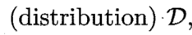
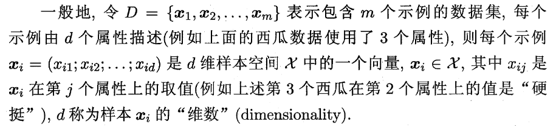
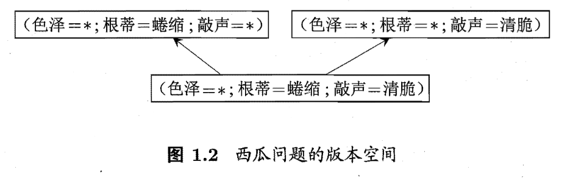
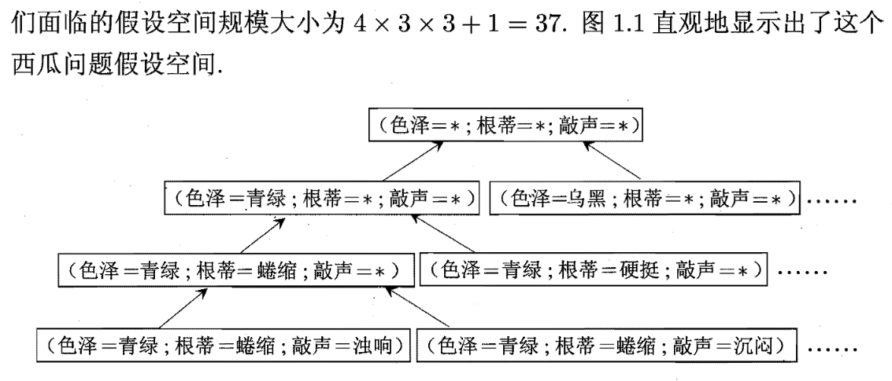
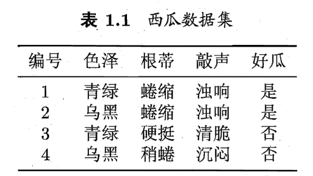

# 机器学习

## 关键单词

- 模型 (model)
- 学习算法 (learning algorithm)
- 数据集 (data set)
- 示例 (instance)
- 样本 (sample)
  - 样本空间 （sample space)
- 副主 (attribute)
  - 属性值 (attirbute value)
  - 属性空间 (attribute space)
- 特征 (feature)
  - 特征向量 (feature vector) - 如果把一个特征放在三维坐标轴，这个位置较特征向量
  - 特征选择 （feature selection) - 
- 维数 (dimensionality) - 这是一个示例的属性的数量。比如一个西瓜可以有色彩，根底本质，敲起来声音， 等。有四个属性，那维数是三。一般地，d表代维数
- 训练数据 （training data)
- 训练样本 (training sample)
- 训练集 (training set)
- 学习器 （learner）- 模型亦称学习器。
- 预测 （prediction)
- 標記 (label) - 通常有结果。本书用好瓜
- 标记空间 （label space)
- 样例 (example) - 拥有示例和它的标记叫样例
- 样本 （sample) - 有时候整个数据集亦称样本。这个单词可以表示一个示例（一个西瓜）或者可以是一个西瓜多。要看上下文
- 分类 (classification) - 若我们预测结果这叫分类。比如好瓜或坏瓜
- 回归 (regression) 如果我们想知道连续值，例如西瓜成熟度.95
- 二分类 (binary classification) 若只有两个类别，这是二分类。
- 正类 (positive class) - 在二分类里，这是“好”的类别。反类 (negative class) 是相反
- 多分类 (multiclass classification) - 有二类别多
- 测试样本 - 被预测的样本
- 聚类 (clustering)
  - 笔记：我们常常没有标记；是噢们想知道类型 - 比如说是个浅色瓜
- 簇 cù (cluster)
- 监督学习 (supervised learning) 我们已经有标记。 包括分类学习，回归学习，等。。。
- 无监督学习 (unsupervised learning) 我们没有标记。 包括聚类学习
- 泛化 (generalization)　学的模型适用于新样本的能力
- 分布 （distribution) 
  - 独立同分布 （independent and identically distributed [i.i.d])
- 归纳 (induction) - 这是从特殊到一般的泛化。
- 演绎 (deduction) - 这是凡相反，从一般数据到特化数据
- 匹配 (fit) - 在这里表示可以对的答应我们的问题
- 假设空间 （hypothesis space)
- [版本空间 （version space)](#版本空间) 版本空间(version space)是概念学习中与已知数据集一致的所有假设(hypothesis)的子集集合。
- 归纳偏好 (inductive bias) 我们的算法的偏好。尽可能特殊即"适用情形尽可能少".尽可能一般即"适用情形尽可能多"
- 
## 我们怎么表示示例

## 我饿的笔记

- ∈ 又是什么意思？
  - 集合的關係中，表示「屬於」的「∈」符號

## 版本空间

只是因为好瓜只有根蒂=蜷缩，敲声=浊响，和色泽可以是任何。每个上述的版本有至少一个正确的答案

## 假设空间

有４ｘ３ｘ３＋１的选择因为可以选３，２，２：

每个选择也可以是任何加都任何